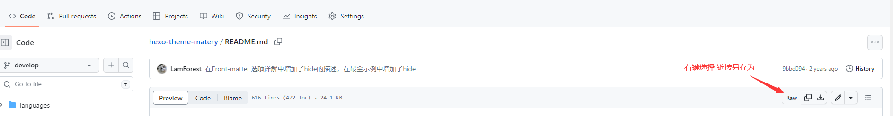
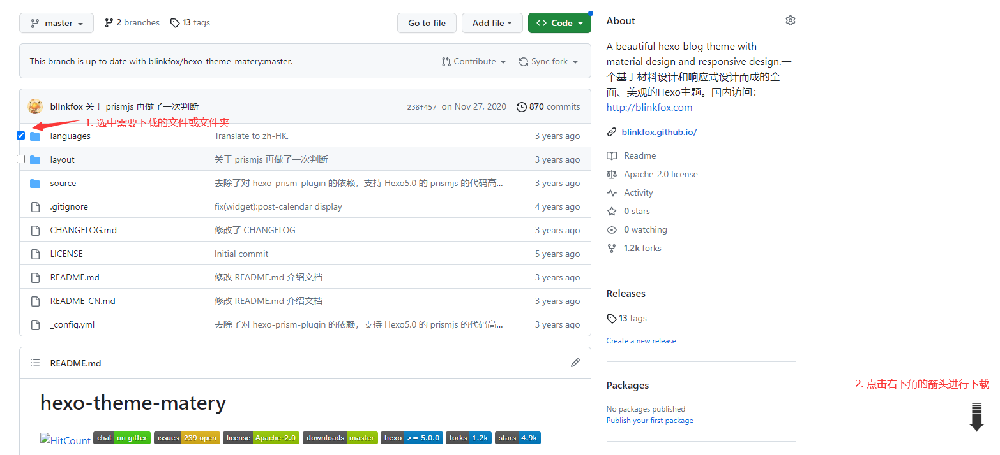

# github.com 使用技巧

## 下载文件

​	一般情况我们使用 `git clone` 或者 **Download ZIP**，拉取或下载整个项目到本地。如果项目过大，而且只想下载单个 文件或者文件夹，可采用以下方式：

### Raw

对于单个文件，可进入该文件，右键点击 **Raw**，选着**链接另存为**，即可将当前文件下载下来。效果如图：

### GitZip 插件

谷歌 GitZip 插件下载方式：

* 插件小屋：https://www.chajianxw.com/，中搜索 GitZip，并下载；
* 谷歌商店中搜索 GitZip，并下载；

将下载好的插件添加到  谷歌浏览器 的扩展程序中，并启动；

鼠标所指的 文件/文件夹 左边会出现选着框，勾选选着框，点击右下角箭头，即可下载指定的 文件/文件夹。效果如图：

