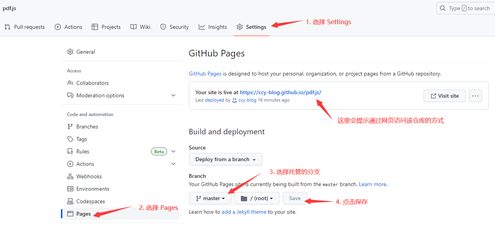
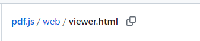
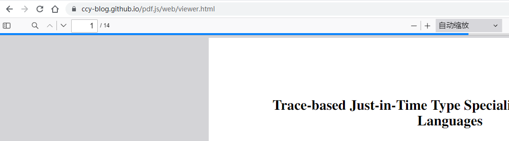
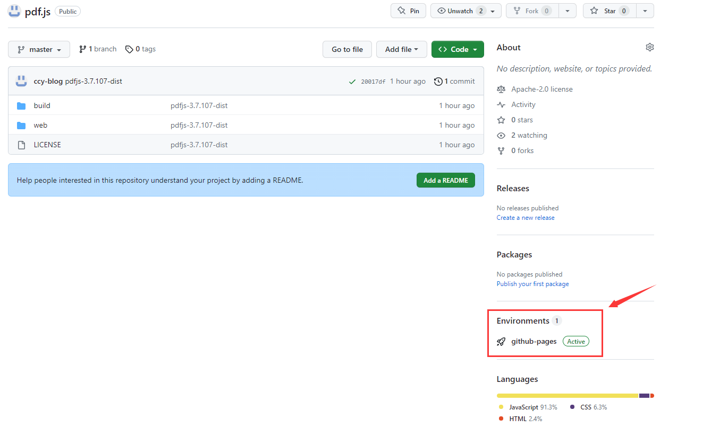

## github pages 使用方式

如何使用 **git page** 将仓库托管到 **Github** 的服务器上：

1\. 在 github.com 新建仓库；

​	注意：如果仓库名是 `username.github.io` 那么通过：`https://username.github.io` 站点即可访问该仓库（如：https://ccy-blog.github.io）；如果仓库名是其他的，通过：`https://username.github.io/仓库名` 站点访问（如：https://ccy-blog.github.io/pdf.js）

2\. 设置该仓库： 

3\. 将文件放入仓库；

4\. 即可通过 `username.github.io/仓库名/文件路径` 访问；

5\. 比如 **pdf.js** 仓库下，web/ 目录下的  `viewer.html` 文件，通过 https://username.github.io/pdf.js/web/viewer.html 访问

6\. 访问效果如图：

7\. 可以通过右下角查看是否部署完成，每次更新仓库时都会自动重新部署（Active 表示部署完成）

