**# 基于 docsify 搭建个人博客**

## Docsify

官网链接：https://docsify.js.org/

​	一个动态生成文档网站的。类似于 **GitBook、Hexo**，与其不同点是，Docsify 不会将 `.md` 转换成 `.html` 文件进行显示，而是运行时进行动态转换。使用时只需要创建一个 `index.html` ，就可以开始写文档而且直接部署在 服务器（如：**github Pages**）进行发布，方便、快捷、格式友好，样式不错。


## 安装工具

**安装 git**：http://git-scm.com/ 

**安装 nodejs**：http://nodejs.org/

**安装 docsify**：

```shell
# 使用 git 执行命令安装 docsify-cli 工具
npm i docsify-cli -g
```


## docsify 使用

参考官方文档：https://docsify.js.org/#/?id=docsify

1\. 执行命令初始化目录结构：

```shell
# docsif init 自定义的目录
docsify init ./docsify
```

会在自定义的目录下生成三个文件：

* **index.html**：入口文件
* **README.md**：会做为主页内容渲染
* **.nojekyll**：用于阻止 GitHub Pages 会忽略掉下划线开头的文件


2\. 本地预览

执行命令运行 docsify 本地服务器：

​	`docsify serve docs`

默认通过 http://localhost:3000/#/ 和 http://127.0.0.1:3000/#/ 进行网页访问，访问效果如图：

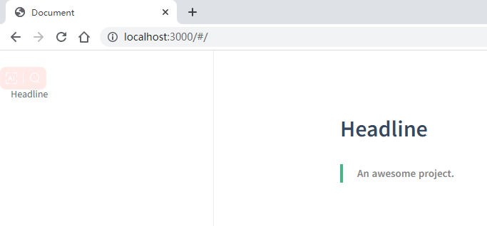


## 个性化

### 添加主页标题

​	效果如图：

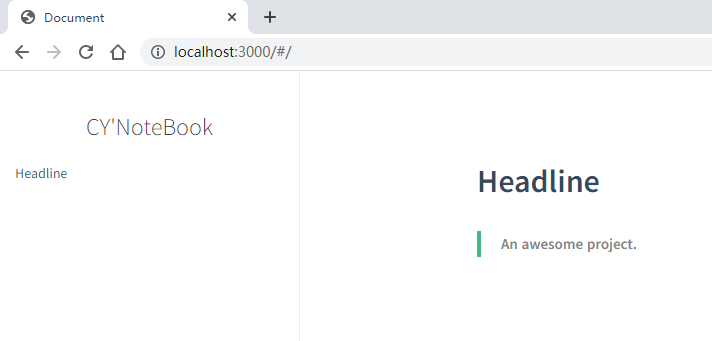


​	在 **index.html** 文件中添加 **name** 字段：

```html
<script>
    window.$docsify = {
      name: 'NoteBook',
    }
</script>
```


### 添加主页标题链接

​	点击主页标题能跳转到指定的链接位置；

​	在 **index.html** 文件中添加 **nameLinux** 字段：

```html
<script>
    window.$docsify = {
      nameLink: 'http://www.ccyblog.top'
    }
</script>
```

​	


### 添加 GitHub 图标

​	效果如图：

	

​	在 **index.html** 文件中添加 **repo** 字段：

```html
<script>
    window.$docsify = {
      nameLink: 'ccy-blog/NoteBook'
    }
</script>
```

​	点击左上角的 Github 图标会跳转到 github 指定的链接处。


### 添加页脚

效果如图：

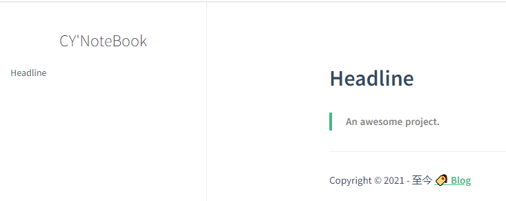

* 在 **index.html** 文件中添加 **footer** 字段：

```html
<script>
    window.$docsify = {
	  footer: {
        copy: '<span>Copyright &copy; 2021 - 至今</span>',
		auth: ' <a href="https://ccy-blog.github.io/" target="_blank">🏷️ Blog</a>',
		pre: '<hr/>',
		style: 'text-align: left;',
	  },
    }
</script>

```

* 在 <head> 中添加如下内容：

```html
<script src="//unpkg.com/docsify-footer-enh/dist/docsify-footer-enh.min.js"></script>
```


### 添加搜索功能

​	效果如图：

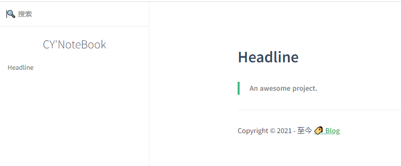

​	在 **index.html** 文件中添加 **search** 字段：

```html
<script>
    window.$docsify = {
		search: {
        	paths: 'auto',
	        placeholder: '🔍 搜索',
    	    noData: '😒 找不到结果',
        	// Headline depth, 1 - 6
        	depth: 6,
        	maxAge: 86400000, // 过期时间，单位毫秒，默认一天
      	},
    }
</script>
<script src="https://cdn.jsdelivr.net/gh/wugenqiang/NoteBook@master/plugin/search.min.js"></script>
```


## 定制功能

效果参考：[docsifyBlog_effect.md](other/docsifyBlog_effect)

### 支持 DOT 语言作图

> DOT 语言是贝尔实验室开发的用于作图的脚本语言，最初在桌面端程序 Graphviz 中支持。后来有人开发了 Viz.js 使得浏览器端也能支持 DOT 语言作图的渲染。我们的目的如下：当 Markdown 渲染器识别到一处语言名为 dot 代码块时，就调用 Viz.js 渲染代码块中的语句，使它们成为 DOT 语言定义的矢量图。

> 具体操作如下：（以下所有操作都在 docsify 项目的 index.html 文件中进行）

​	添加字段：

```js
<script>
    window.$docsify = {
      markdown: {
        renderer: {
          code: function(code, lang) {
            if (lang.toLowerCase() === "dot") {
              return (
                      '<div class="viz">'+ Viz(code, "SVG")+'</div>'
              );
            }
            return this.origin.code.apply(this, arguments);
          }
        }
      }
    }
</script>
<script src="https://cdn.jsdelivr.net/npm/viz.js@1.8.0/viz.js"></script>
```


​	Markdown 中的实现：

````markdown
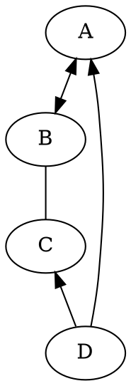
````

​	HTML 页面显示效果

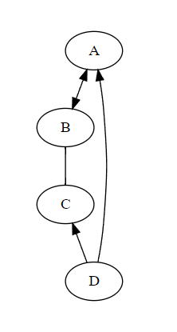


### 支持 LaTax 数学公式

> LaTeX 是大门鼎鼎的文档排版软件，它对于数学公式的支持非常好。和 DOT 语言类似，一开始也是只有桌面端程序支持，但是后来同样有人开发了各种各样的 .js 来在浏览器端进行支持。

> 具体操作如下：（以下所有操作都在 docsify 项目的 index.html 文件中进行）

下载链接：https://github.com/katex

​	在 <head> 中添加如下内容：

```html
<link rel="stylesheet" href="//cdn.jsdelivr.net/npm/katex@latest/dist/katex.min.css"/>
```

​	在 <body> 中添加如下内容：

```html
<!-- docsy-katex 的 CDN文件 -->
<script src="//cdn.jsdelivr.net/npm/docsify-katex@latest/dist/docsify-katex.js"></script>
<!-- 或 <script src="//cdn.jsdelivr.net/gh/upupming/docsify-katex@latest/dist/docsify-katex.js"></script> -->
```


​	Markdown 中的使用方式：

```markdown
$$
\left[
\begin{matrix}
 1      & 2      & \cdots & 4      \\
 7      & 6      & \cdots & 5      \\
 \vdots & \vdots & \ddots & \vdots \\
 8      & 9      & \cdots & 0      \\
\end{matrix}
\right]
$$
```

​	HTML 页面效果图：

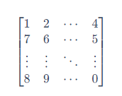


### 支持 PDF 页面显示

​	在 <body> 中添加如下内容：

```html
<!-- PDFObject.js是这个插件的必需依赖项 -->
<script src="//cdnjs.cloudflare.com/ajax/libs/pdfobject/2.1.1/pdfobject.min.js"></script> 
<script src="//unpkg.com/docsify-pdf-embed-plugin/src/docsify-pdf-embed.js"></script>
```

```js
markdown: {
    renderer: {
        code: function(code, lang, base=null) {
            var pdf_renderer = function(code, lang, verify) {
                function unique_id_generator(){
                    function rand_gen(){
                        return Math.floor((Math.random()+1) * 65536).toString(16).substring(1);
                    }
                    return rand_gen() + rand_gen() + '-' + rand_gen() + '-' + rand_gen() + '-' + rand_gen() + '-' + rand_gen() + rand_gen() + rand_gen();
                }
                if(lang && !lang.localeCompare('pdf', 'en', {sensitivity: 'base'})){
                    if(verify){
                        return true;
                    }else{
                        var divId = "markdown_code_pdf_container_" + unique_id_generator().toString();
                        var container_list = new Array();
                        if(localStorage.getItem('pdf_container_list')){
                            container_list = JSON.parse(localStorage.getItem('pdf_container_list'));
                        }
                        container_list.push({"pdf_location": code, "div_id": divId});
                        localStorage.setItem('pdf_container_list', JSON.stringify(container_list));
                        return (
                            '<div style="margin-top:'+ PDF_MARGIN_TOP +'; margin-bottom:'+ PDF_MARGIN_BOTTOM +';" id="'+ divId +'">'
                            + '<a href="'+ code + '"> Link </a> to ' + code +
                            '</div>'
                        );
                    }
                }
                return false;
            }
            if(pdf_renderer(code, lang, true)){
                return pdf_renderer(code, lang, false);
            }
            //return this.origin.code.apply(this, arguments);
            return (base ? base : this.origin.code.apply(this, arguments));
        }
    }
}
```


​	Markdown 中的使用方式：

````markdown
```pdf
https://username.github.io/pdf.js/web/viewer.html?file=./compressed.tracemonkey-pldi-09.pdf
```
````


​	HTML 页面效果图：

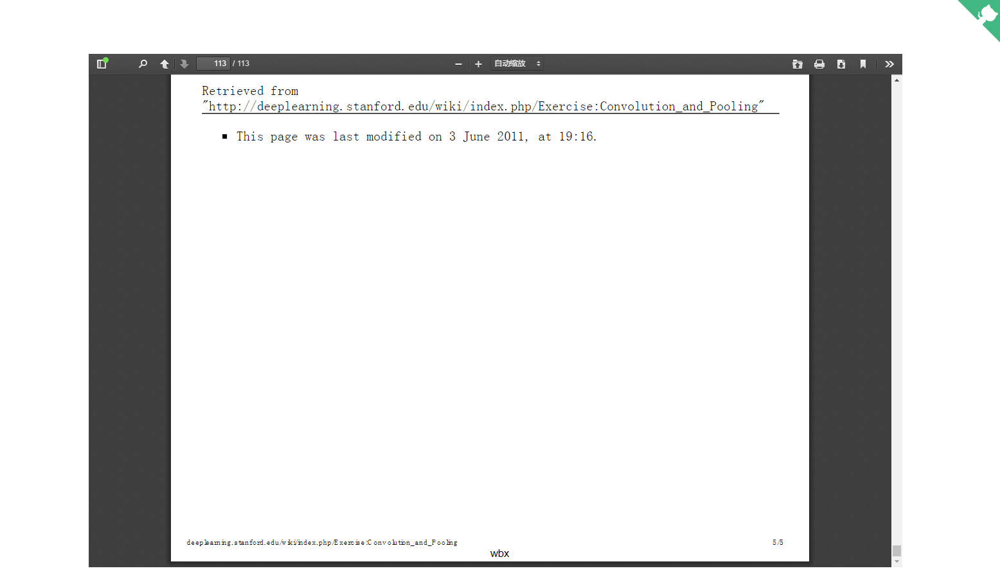


### 支持回到顶部

​	在 <body> 中添加如下内容：

```html
<!-- 使用 jQuery 库 -->
<script src="https://wugenqiang.github.io/CS-Notes/plugin/jquery.js"></script>
<script src="https://wugenqiang.github.io/CS-Notes/plugin/jquery.goup.js"></script>
```

```html
<script type="text/javascript">
    $(document).ready(function () {
      $.goup({
        trigger: 100,
        bottomOffset: 50,
        locationOffset: 25,
        title: 'TOP',
        titleAsText: true
      });
    });
 </script>
```


​		HTML 页面效果图：


### 鼠标点击出现爱心

​	在 <body> 中添加如下内容：

```html
<script src="//cdn.jsdelivr.net/gh/jerryc127/butterfly_cdn@2.1.0/js/click_heart.js"></script>
```


### 复制内容出现弹窗

​	在 <head> 中添加如下内容：

```html
<link rel="stylesheet" href="https://cdn.bootcss.com/sweetalert/1.1.3/sweetalert.min.css" type='text/css' media='all' />
```

​	在 <body> 中添加如下内容：

```html
<script src="https://cdn.bootcss.com/sweetalert/1.1.3/sweetalert.min.js"></script>
<script>
  document.body.oncopy = function () {
    swal("复制成功 🎉",
            "若要转载或引用请务必保留原文链接，并申明来源。如果你觉得本仓库不错，那就来 GitHub 给个 Star 吧 😊   - by 吴跟强",
            "success"); };
</script>
```


​	HTML 页面显示效果：

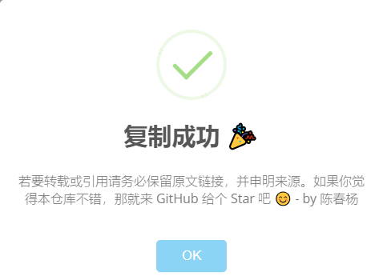


### 添加网站运行时间

​	在 <body> 中添加如下内容：

```html
<!-- 运行时间统计 -->
<script language=javascript>
  function siteTime() {
    window.setTimeout("siteTime()", 1000);
    var seconds = 1000;
    var minutes = seconds * 60;
    var hours = minutes * 60;
    var days = hours * 24;
    var years = days * 365;
    var today = new Date();
    var todayYear = today.getFullYear();
    var todayMonth = today.getMonth() + 1;
    var todayDate = today.getDate();
    var todayHour = today.getHours();
    var todayMinute = today.getMinutes();
    var todaySecond = today.getSeconds();
    /* Date.UTC() -- 返回date对象距世界标准时间(UTC)1970年1月1日午夜之间的毫秒数(时间戳)
    year - 作为date对象的年份，为4位年份值
    month - 0-11之间的整数，做为date对象的月份
    day - 1-31之间的整数，做为date对象的天数
    hours - 0(午夜24点)-23之间的整数，做为date对象的小时数
    minutes - 0-59之间的整数，做为date对象的分钟数
    seconds - 0-59之间的整数，做为date对象的秒数
    microseconds - 0-999之间的整数，做为date对象的毫秒数 */
    var t1 = Date.UTC(2020, 02, 10, 00, 00, 00); //北京时间2020-02-10 00:00:00
    var t2 = Date.UTC(todayYear, todayMonth, todayDate, todayHour, todayMinute, todaySecond);
    var diff = t2 - t1;
    var diffYears = Math.floor(diff / years);
    var diffDays = Math.floor((diff / days) - diffYears * 365);
    var diffHours = Math.floor((diff - (diffYears * 365 + diffDays) * days) / hours);
    var diffMinutes = Math.floor((diff - (diffYears * 365 + diffDays) * days - diffHours * hours) / minutes);
    var diffSeconds = Math.floor((diff - (diffYears * 365 + diffDays) * days - diffHours * hours - diffMinutes * minutes) / seconds);
    document.getElementById("sitetime").innerHTML = " 本网站已运行 " + diffYears + " 年 " + diffDays + " 天 " + diffHours + " 小时 " + diffMinutes + " 分钟 " + diffSeconds + " 秒 ";
  }
  window.onload = siteTime;
</script>
```


​	在页脚部分添加代码：

```html
<script>
    window.$docsify = {
	  footer: {
        copy: '<span id="sitetime"></span> <br/> <span>Copyright &copy; 2021 - 至今</span>',
		auth: ' <a href="https://ccy-blog.github.io/" target="_blank">🏷️ Blog</a>',
		pre: '<hr/>',
		style: 'text-align: left;',
	  },
    }
</script>
```


​	HTML 页面显示效果：


### 美化提示样式

参考链接：https://github.com/fzankl/docsify-plugin-flexible-alerts

​	在 <body> 中添加如下内容：

```html
<!-- 修改 flat 为 callout 可显示为另一种样式 -->
<script>
  window.$docsify = {
    'flexible-alerts': {
      style: 'flat'
    }
  };
</script>
<script src="https://unpkg.com/docsify-plugin-flexible-alerts"></script>
```


​	Markdown 中的使用方式：

```markdown
> [!NOTE]
> An alert of type 'note'
```


​	HTML 页面显示效果，以下三种样式分别是：无样式、`flat` 样式、`callout` 样式：

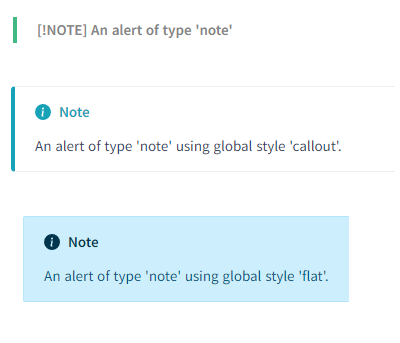

**自定义标题**

​	Markdown 中的使用方式：

```markdown
> [!TIP|style:flat|label:My own heading|iconVisibility:hidden]
> 一个类型为 ‘tip’ 的警报 | 使用警报特定样式 ‘flat’ 覆盖全局样式 ‘callout’ | 此外，该警报使用自己的标题 | 隐藏特定的图标。
```

​	HTML 页面显示效果：

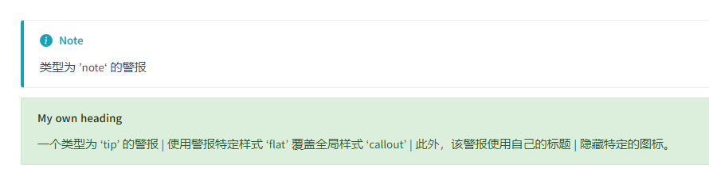


**自定义类型 COMMENT**

```html
<script>
  window.$docsify = {
    'flexible-alerts': {
      comment: {
        label: "Comment",

        // localization
        label: {
          '/en-GB/': 'Comment',
          '/': 'Kommentar'
        },

        // Assuming that we use Font Awesome
        icon: "fas fa-comment",
        className: "info"
      }
    }
  };
</script>
```

​	Markdown 中的使用方式：

```markdown
> [!COMMENT]
> An alert of type 'comment' using style 'callout' with default settings.
```

​	HTML 页面中显示效果：

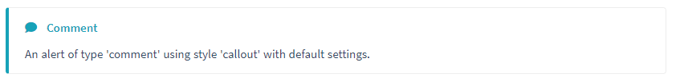


### 右下角添加模型

​	参考链接：https://github.com/xiazeyu

​	在 <body> 中添加如下内容：

```html
<script src="https://eqcn.ajz.miesnfu.com/wp-content/plugins/wp-3d-pony/live2dw/lib/L2Dwidget.min.js"></script>
<script>
  L2Dwidget.init({
    "model": {
      //jsonpath控制显示那个小萝莉模型，
      //(切换模型需要改动)
      jsonPath: "https://unpkg.com/live2d-widget-model-koharu@1.0.5/assets/koharu.model.json",
      "scale": 1
    },
    "display": {
      "position": "right", //看板娘的表现位置
      "width": 70,  //小萝莉的宽度
      "height": 140, //小萝莉的高度
      "hOffset": 35,
      "vOffset": -20
    },
    "mobile": {
      "show": true,
      "scale": 0.5
    },
    "react": {
      "opacityDefault": 0.7,
      "opacityOnHover": 0.2
    }
  });
</script>复制请点击Error复制成功
```

​	HTML 页面中显示效果：


### 访问量统计

​	在 <body> 中添加如下内容：

```html
<!-- 访问量统计 -->
<script async src="//busuanzi.ibruce.info/busuanzi/2.3/busuanzi.pure.mini.js"></script>
```

​	在需要统计的 Markdown 文件中，插入以下内容：

```markdown
<br>
<span id="busuanzi_container_site_pv" style='display:none'>
    👀 本站总访问量：<span id="busuanzi_value_site_pv"></span> 次
</span>
<span id="busuanzi_container_site_uv" style='display:none'>
    | 🚴‍♂️ 本站总访客数：<span id="busuanzi_value_site_uv"></span> 人
</span>
```

​	HTML 页面显示效果：


## 离线模式

> 渐进式 Web 应用程序（PWA）是将最好的网络与最好的应用程序结合在一起的体验。我们可以与服务人员一起增强我们的网站，以使其脱机工作或使用低质量的网络。

**1\. 创建 serviceWorker**

​	在根目录下创建一个文件：`pwa.js`，然后复制以下代码：

```js
/* ===========================================================
 * docsify pwa.js
 * ===========================================================
 * Copyright 2016 @huxpro
 * Licensed under Apache 2.0
 * Register service worker.
 * ========================================================== */

const RUNTIME = 'docsify'
const HOSTNAME_WHITELIST = [
  self.location.hostname,
  'fonts.gstatic.com',
  'fonts.googleapis.com',
  'cdn.jsdelivr.net'
]

// The Util Function to hack URLs of intercepted requests
const getFixedUrl = (req) => {
  var now = Date.now()
  var url = new URL(req.url)

  // 1. fixed http URL
  // Just keep syncing with location.protocol
  // fetch(httpURL) belongs to active mixed content.
  // And fetch(httpRequest) is not supported yet.
  url.protocol = self.location.protocol

  // 2. add query for caching-busting.
  // Github Pages served with Cache-Control: max-age=600
  // max-age on mutable content is error-prone, with SW life of bugs can even extend.
  // Until cache mode of Fetch API landed, we have to workaround cache-busting with query string.
  // Cache-Control-Bug: https://bugs.chromium.org/p/chromium/issues/detail?id=453190
  if (url.hostname === self.location.hostname) {
    url.search += (url.search ? '&' : '?') + 'cache-bust=' + now
  }
  return url.href
}

/**
 *  @Lifecycle Activate
 *  New one activated when old isnt being used.
 *
 *  waitUntil(): activating ====> activated
 */
self.addEventListener('activate', event => {
  event.waitUntil(self.clients.claim())
})

/**
 *  @Functional Fetch
 *  All network requests are being intercepted here.
 *
 *  void respondWith(Promise<Response> r)
 */
self.addEventListener('fetch', event => {
  // Skip some of cross-origin requests, like those for Google Analytics.
  if (HOSTNAME_WHITELIST.indexOf(new URL(event.request.url).hostname) > -1) {
    // Stale-while-revalidate
    // similar to HTTP's stale-while-revalidate: https://www.mnot.net/blog/2007/12/12/stale
    // Upgrade from Jake's to Surma's: https://gist.github.com/surma/eb441223daaedf880801ad80006389f1
    const cached = caches.match(event.request)
    const fixedUrl = getFixedUrl(event.request)
    const fetched = fetch(fixedUrl, { cache: 'no-store' })
    const fetchedCopy = fetched.then(resp => resp.clone())

    // Call respondWith() with whatever we get first.
    // If the fetch fails (e.g disconnected), wait for the cache.
    // If there’s nothing in cache, wait for the fetch.
    // If neither yields a response, return offline pages.
    event.respondWith(
      Promise.race([fetched.catch(_ => cached), cached])
        .then(resp => resp || fetched)
        .catch(_ => { /* eat any errors */ })
    )

    // Update the cache with the version we fetched (only for ok status)
    event.waitUntil(
      Promise.all([fetchedCopy, caches.open(RUNTIME)])
        .then(([response, cache]) => response.ok && cache.put(event.request, response))
        .catch(_ => { /* eat any errors */ })
    )
  }
})
```


**2\. 寄存器**

现在，在 **index.html** 中添加下面代码。由于它仅在某些现代浏览器上有效，因此我们需要判断：

```html
<!-- 实现离线化 -->
<script>
    if (typeof navigator.serviceWorker !== 'undefined') {
        navigator.serviceWorker.register('pwa.js')
    }
</script>
```

发布您的网站并开始体验神奇的离线功能。👻您可以关闭Wi-Fi并刷新当前站点以进行体验。


## other

### 代码块复制

​	在 <body> 中添加如下内容：

```html
<script src="//cdn.jsdelivr.net/npm/docsify-copy-code"></script>
```


### 修改网页标题

​	在 <head> 中修改如下内容：

```html
<title>CY' NoteBook</title>
```


### 添加网页图标

​	在 <head> 中修改如下内容：

```html
<link rel="icon" href="images/favicon.svg">
```


### 添加站点收录？？？

```html
<!-- 谷歌站点收录 -->
<meta name="google-site-verification" content="qTFCf1hJ275saQ7H1kin5t2DVpznBKAj0Gi50XMOVMo" />
<!-- 百度站点收录 -->
<meta name="baidu-site-verification" content="SZyWUIzWiU" />

<script>
	// 谷歌分析 SEO
    ga: 'UA-164658031-2',
</script>

<!-- 谷歌分析 -->
<script src="https://notebook.js.org/plugin/js/ga.min.js"></script>
```


### 代码块高亮

下载链接：https://github.com/PrismJS/prism/tree/master

​	在 <body> 中添加如下内容：

```html
<!-- 依赖的 prism.js 文件 -->
<script src="plugin/prism/js/prism.js"></script>
<!-- 各种语言的样式, components 文件下 -->
<script src="plugin/prism/js/prism-c.js"></script>
```


