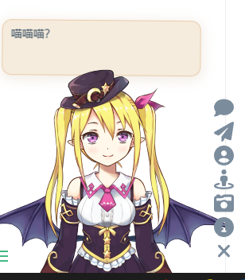
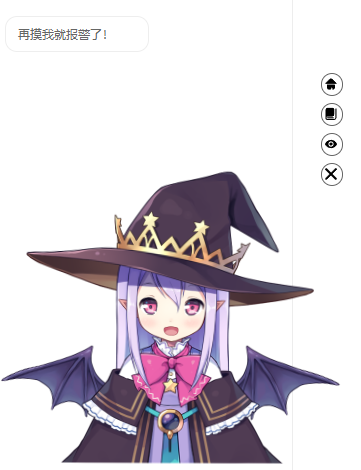

# 看板娘 fghrsh（Z-Blog）1.4

**（模型基于后端 API）**

源码下载链接：https://github.com/fghrsh/live2d_demo

目录结构：

```tex
.
├──demo1-default.html		# 使用方式 1（在 HTML 中同步加载模型）
├──demo2-autoload.html		# 使用方式 2（通过 autoload.js 文件使用 ajax 异步加载模型）（我采用的方式）
├──demo3-waifu-tips.html	# 使用方式 3（将 aotoload.js 文件内容直接写入 HTML，使用 ajax 异步加载模型）
└──assets
	├──autoload.js					# 自动异步加载
	├──flat-ui-icons-regular.eot	# Flat UI 字体
	├──flat-ui-icons-regular.svg	# Flat UI 字体
	├──flat-ui-icons-regular.ttf	# Flat UI 字体
	├──flat-ui-icons-regular.woff	# Flat UI 字体
	├──live2d.js					# Live2D 核心
	├──waifu-tips.js				# Live2D 看板娘 参数
	├──waifu-tips.json				# Live2D 看板娘 提示语
	└──waifu.css					# Live2D 看板娘 样式表
```


**特性**

- 基于 API 加载模型，支持 定制 提示语
- 参数设置，一键定制看板娘
- 支持多种一言接口
- 基于 JQuery UI 实现拖拽


## 使用方式 1

​	在 **index.html** 的 <head> 中添加如下内容：

```html
<link rel="stylesheet" type="text/css" href="assets/waifu.min.css?v=1.4.2"/>
```

​	在 **index.html** 的 <body> 中添加如下内容：

```html
<!-- waifu-tips.js 依赖 JQuery 库 -->
<script src="jquery.min.js?v=3.3.1"></script>
    
<!-- 实现拖动效果，需引入 JQuery UI -->
<script src="jquery-ui.min.js?v=1.12.1"></script>

<div class="waifu">
    <div class="waifu-tips"></div>
    <canvas id="live2d" class="live2d"></canvas>
    <div class="waifu-tool">
        <span class="fui-home"></span>
        <span class="fui-chat"></span>
        <span class="fui-eye"></span>
        <span class="fui-user"></span>
        <span class="fui-photo"></span>
        <span class="fui-info-circle"></span>
        <span class="fui-cross"></span>
    </div>
</div>

<script src="assets/waifu-tips.min.js?v=1.4.2"></script>
<script src="assets/live2d.min.js?v=1.0.5"></script>
<script type="text/javascript">
    /* 可直接修改部分参数 */
    live2d_settings['modelId'] = 1;                  // 默认模型 ID
    live2d_settings['modelTexturesId'] = 87;         // 默认材质 ID
    live2d_settings['modelStorage'] = false;         // 不储存模型 ID
    live2d_settings['canCloseLive2d'] = false;       // 隐藏 关闭看板娘 按钮
    live2d_settings['canTurnToHomePage'] = false;    // 隐藏 返回首页 按钮
    live2d_settings['waifuSize'] = '600x535';        // 看板娘大小
    live2d_settings['waifuTipsSize'] = '570x150';    // 提示框大小
    live2d_settings['waifuFontSize'] = '30px';       // 提示框字体
    live2d_settings['waifuToolFont'] = '36px';       // 工具栏字体
    live2d_settings['waifuToolLine'] = '50px';       // 工具栏行高
    live2d_settings['waifuToolTop'] = '-60px';       // 工具栏顶部边距
    live2d_settings['waifuDraggable'] = 'axis-x';    // 拖拽样式
    /* 在 initModel 前添加 */
    initModel("assets/waifu-tips.json?v=1.4.2")
</script>
```


## 使用方式 2

​	在 **index.html** 的 <body> 中添加如下内容：

```html
<script src="assets/autoload.js"></script>
```

​	<font color='red'>注意：需要修改 `autoload.js` 文件中的 路径以及文件名</font>


## 使用方式 3

​	在 **index.html** 的 <head> 中添加如下内容：

```html
<link rel="stylesheet" type="text/css" href="assets/waifu.min.css?v=1.4.2"/>
```

​	在 **index.html** 的 <body> 中添加如下内容：

```html
<!-- waifu-tips.js 依赖 JQuery 库 -->
<script src="assets/jquery.min.js?v=3.3.1"></script>

$("<link>").attr({href: "assets/waifu.min.css?v=1.4.2", rel: "stylesheet", type: "text/css"}).appendTo('head');

<!-- 实现拖动效果，需引入 JQuery UI -->
<script src="assets/jquery-ui.min.js?v=1.12.1"></script>

<script type="text/javascript">
/* 把 autoload.js 内容直接内置 */
    $('body').append('<div class="waifu"><div class="waifu-tips"></div><canvas id="live2d" class="live2d"></canvas><div class="waifu-tool"><span class="fui-home"></span> <span class="fui-chat"></span> <span class="fui-eye"></span> <span class="fui-user"></span> <span class="fui-photo"></span> <span class="fui-info-circle"></span> <span class="fui-cross"></span></div></div>');
    $.ajax({url: "assets/waifu-tips.min.js?v=1.4.2", dataType:"script", cache: true, success: function() {
        $.ajax({url: "assets/live2d.min.js?v=1.0.5", dataType:"script", cache: true, success: function() {
            /* 可直接修改部分参数 */
            live2d_settings['hitokotoAPI'] = 'jinrishici.com'; // 一言 API
            live2d_settings['modelId'] = 2;                    // 默认模型 ID
            live2d_settings['modelTexturesId'] = 6;            // 默认材质 ID
            live2d_settings['modelStorage'] = false;           // 不储存模型 ID
            live2d_settings['canCloseLive2d'] = false;         // 隐藏 关闭看板娘 按钮
            live2d_settings['canTurnToHomePage'] = false;      // 隐藏 返回首页 按钮
            live2d_settings['waifuSize'] = '600x535';          // 看板娘大小
            live2d_settings['waifuTipsSize'] = '570x150';      // 提示框大小
            live2d_settings['waifuFontSize'] = '30px';         // 提示框字体
            live2d_settings['waifuEdgeSide'] = 'right:30';     // 看板娘贴边方向
            live2d_settings['waifuToolFont'] = '36px';         // 工具栏字体
            live2d_settings['waifuToolLine'] = '50px';         // 工具栏行高
            live2d_settings['waifuToolTop'] = '-60px';         // 工具栏顶部边距
            live2d_settings['waifuDraggable'] = 'axis-x';      // 拖拽样式

            /* 内置 waifu-tips.json */
            initModel({
                "waifu": {
                    "console_open_msg": ["哈哈，你打开了控制台，是想要看看我的秘密吗？"],
                    "copy_message": ["你都复制了些什么呀，转载要记得加上出处哦"],
                    "screenshot_message": ["照好了嘛，是不是很可爱呢？"],
                    "hidden_message": ["我们还能再见面的吧…"],
                    "load_rand_textures": ["我还没有其他衣服呢", "我的新衣服好看嘛"],
                    "hour_tips": {
                        "t5-7": ["早上好！一日之计在于晨，美好的一天就要开始了"],
                        "t7-11": ["上午好！工作顺利嘛，不要久坐，多起来走动走动哦！"],
                        "t11-14": ["中午了，工作了一个上午，现在是午餐时间！"],
                        "t14-17": ["午后很容易犯困呢，今天的运动目标完成了吗？"],
                        "t17-19": ["傍晚了！窗外夕阳的景色很美丽呢，最美不过夕阳红~"],
                        "t19-21": ["晚上好，今天过得怎么样？"],
                        "t21-23": ["已经这么晚了呀，早点休息吧，晚安~"],
                        "t23-5": ["你是夜猫子呀？这么晚还不睡觉，明天起的来嘛"],
                        "default": ["嗨~ 快来逗我玩吧！"]
                    },
                    "referrer_message": {
                        "localhost": ["欢迎阅读<span style=\"color:#0099cc;\">『", "』</span>", " - "],
                        "baidu": ["Hello! 来自 百度搜索 的朋友<br>你是搜索 <span style=\"color:#0099cc;\">", "</span> 找到的我吗？"],
                        "so": ["Hello! 来自 360搜索 的朋友<br>你是搜索 <span style=\"color:#0099cc;\">", "</span> 找到的我吗？"],
                        "google": ["Hello! 来自 谷歌搜索 的朋友<br>欢迎阅读<span style=\"color:#0099cc;\">『", "』</span>", " - "],
                        "default": ["Hello! 来自 <span style=\"color:#0099cc;\">", "</span> 的朋友"],
                        "none": ["欢迎阅读<span style=\"color:#0099cc;\">『", "』</span>", " - "]
                    },
                    "referrer_hostname": {
                        "example.com": ["示例网站"],
                        "www.fghrsh.net": ["FGHRSH 的博客"]
                    },
                    "model_message": {
                        "1": ["来自 Potion Maker 的 Pio 酱 ~"],
                        "2": ["来自 Potion Maker 的 Tia 酱 ~"]  
                    },
                    "hitokoto_api_message": {
                        "lwl12.com": ["这句一言来自 <span style=\"color:#0099cc;\">『{source}』</span>", "，是 <span style=\"color:#0099cc;\">{creator}</span> 投稿的", "。"],
                        "fghrsh.net": ["这句一言出处是 <span style=\"color:#0099cc;\">『{source}』</span>，是 <span style=\"color:#0099cc;\">FGHRSH</span> 在 {date} 收藏的！"],
                        "jinrishici.com": ["这句诗词出自 <span style=\"color:#0099cc;\">《{title}》</span>，是 {dynasty}诗人 {author} 创作的！"],
                        "hitokoto.cn": ["这句一言来自 <span style=\"color:#0099cc;\">『{source}』</span>，是 <span style=\"color:#0099cc;\">{creator}</span> 在 hitokoto.cn 投稿的。"]
                    }
                },
                "mouseover": [
                    { "selector": ".container a[href^='http']", "text": ["要看看 <span style=\"color:#0099cc;\">{text}</span> 么？"] },
                    { "selector": ".fui-home", "text": ["点击前往首页，想回到上一页可以使用浏览器的后退功能哦"] },
                    { "selector": ".fui-chat", "text": ["一言一语，一颦一笑。一字一句，一颗赛艇。"] },
                    { "selector": ".fui-eye", "text": ["嗯··· 要切换 看板娘 吗？"] },
                    { "selector": ".fui-user", "text": ["喜欢换装 Play 吗？"] },
                    { "selector": ".fui-photo", "text": ["要拍张纪念照片吗？"] },
                    { "selector": ".fui-info-circle", "text": ["这里有关于我的信息呢"] },
                    { "selector": ".fui-cross", "text": ["你不喜欢我了吗..."] },
                    { "selector": "#tor_show", "text": ["翻页比较麻烦吗，点击可以显示这篇文章的目录呢"] },
                    { "selector": "#comment_go", "text": ["想要去评论些什么吗？"] },
                    { "selector": "#night_mode", "text": ["深夜时要爱护眼睛呀"] },
                    { "selector": "#qrcode", "text": ["手机扫一下就能继续看，很方便呢"] },
                    { "selector": ".comment_reply", "text": ["要吐槽些什么呢"] },
                    { "selector": "#back-to-top", "text": ["回到开始的地方吧"] },
                    { "selector": "#author", "text": ["该怎么称呼你呢"] },
                    { "selector": "#mail", "text": ["留下你的邮箱，不然就是无头像人士了"] },
                    { "selector": "#url", "text": ["你的家在哪里呢，好让我去参观参观"] },
                    { "selector": "#textarea", "text": ["认真填写哦，垃圾评论是禁止事项"] },
                    { "selector": ".OwO-logo", "text": ["要插入一个表情吗"] },
                    { "selector": "#csubmit", "text": ["要[提交]^(Commit)了吗，首次评论需要审核，请耐心等待~"] },
                    { "selector": ".ImageBox", "text": ["点击图片可以放大呢"] },
                    { "selector": "input[name=s]", "text": ["找不到想看的内容？搜索看看吧"] },
                    { "selector": ".previous", "text": ["去上一页看看吧"] },
                    { "selector": ".next", "text": ["去下一页看看吧"] },
                    { "selector": ".dropdown-toggle", "text": ["这里是菜单"] },
                    { "selector": "c-player a.play-icon", "text": ["想要听点音乐吗"] },
                    { "selector": "c-player div.time", "text": ["在这里可以调整<span style=\"color:#0099cc;\">播放进度</span>呢"] },
                    { "selector": "c-player div.volume", "text": ["在这里可以调整<span style=\"color:#0099cc;\">音量</span>呢"] },
                    { "selector": "c-player div.list-button", "text": ["<span style=\"color:#0099cc;\">播放列表</span>里都有什么呢"] },
                    { "selector": "c-player div.lyric-button", "text": ["有<span style=\"color:#0099cc;\">歌词</span>的话就能跟着一起唱呢"] },
                    { "selector": ".waifu #live2d", "text": ["干嘛呢你，快把手拿开", "鼠…鼠标放错地方了！"] }
                ],
                "click": [
                    {
                        "selector": ".waifu #live2d",
                        "text": [
                            "是…是不小心碰到了吧",
                            "萝莉控是什么呀",
                            "你看到我的小熊了吗",
                            "再摸的话我可要报警了！⌇●﹏●⌇",
                            "110吗，这里有个变态一直在摸我(ó﹏ò｡)"
                        ]
                    }
                ],
                "seasons": [
                    { "date": "01/01", "text": ["<span style=\"color:#0099cc;\">元旦</span>了呢，新的一年又开始了，今年是{year}年~"] },
                    { "date": "02/14", "text": ["又是一年<span style=\"color:#0099cc;\">情人节</span>，{year}年找到对象了嘛~"] },
                    { "date": "03/08", "text": ["今天是<span style=\"color:#0099cc;\">妇女节</span>！"] },
                    { "date": "03/12", "text": ["今天是<span style=\"color:#0099cc;\">植树节</span>，要保护环境呀"] },
                    { "date": "04/01", "text": ["悄悄告诉你一个秘密~<span style=\"background-color:#34495e;\">今天是愚人节，不要被骗了哦~</span>"] },
                    { "date": "05/01", "text": ["今天是<span style=\"color:#0099cc;\">五一劳动节</span>，计划好假期去哪里了吗~"] },
                    { "date": "06/01", "text": ["<span style=\"color:#0099cc;\">儿童节</span>了呢，快活的时光总是短暂，要是永远长不大该多好啊…"] },
                    { "date": "09/03", "text": ["<span style=\"color:#0099cc;\">中国人民抗日战争胜利纪念日</span>，铭记历史、缅怀先烈、珍爱和平、开创未来。"] },
                    { "date": "09/10", "text": ["<span style=\"color:#0099cc;\">教师节</span>，在学校要给老师问声好呀~"] },
                    { "date": "10/01", "text": ["<span style=\"color:#0099cc;\">国庆节</span>，新中国已经成立69年了呢"] },
                    { "date": "11/05-11/12", "text": ["今年的<span style=\"color:#0099cc;\">双十一</span>是和谁一起过的呢~"] },
                    { "date": "12/20-12/31", "text": ["这几天是<span style=\"color:#0099cc;\">圣诞节</span>，主人肯定又去剁手买买买了~"] }
                ]
            });
        }});
    }});
</script>
```


## 定制内容

修改 `waifu-tips.js` 文件，看板娘参数；

修改 `waifu-tips.json` 文件，看板娘提示语；

```json
{
    // 系统提示
    "waifu": {
        "console_open_msg":		// 控制台被打开提醒（支持多句随机）
        "copy_message":			// 内容被复制触发提醒（支持多句随机）
        "screenshot_message":	// 截图提示语（支持多句随机）
        "hidden_message":		// 隐藏提示语（支持多句随机）
        "load_rand_textures": ["我还没有其他衣服呢", "我的新衣服好看嘛"],
        "hour_tips": {			// 时间段欢迎语（支持多句随机）
        },
        "referrer_message": {	// 请求来源欢迎语（不支持多句）
        },
        "referrer_hostname": {	// 请求来源自定义名称（根据 host，支持多句随机）
        },
        "model_message": {		// 模型切换欢迎语（根据模型 ID，支持多句随机）
        },
        "hitokoto_api_message": {// 一言 API 输出模板（不支持多句随机）
        }
    },
	// 鼠标触发提示（根据 CSS 选择器，支持多句随机）
    "mouseover": [
    ],
	// 鼠标点击触发提示（根据 CSS 选择器，支持多句随机）
    "click": [
    ],
	// 节日提示（日期段，支持多句随机）
    "seasons": [
    ]
}
```


# 看板娘 stevenjoezhang 2.1

**（模型基于后端 API）**：


源码下载链接：https://github.com/stevenjoezhang/live2d-widget/

目录结构：

```tex
.
├──autoload.js					# 自动同步加载
├──live2d.min.js				# Live2D 核心
├──waifu-tips.js				# 由 src/waifu-tips.js 自动打包生成，不建议直接修改
├──waifu.css					# Live2D 看板娘 样式表
├──waifu-tips.json				# Live2D 看板娘 提示语
├──rollup.config.js				
├──package.json				
└──src
	├──index.js
	├──message.js
	├──model.js
	├──tools.js
	├──utils.js
	└──waifu-tips.js				# Live2D 看板娘 参数
```


### 使用方式

​	在 **index.html** 的 <body> 中添加如下内容：

```html
<script src="autoload.js"></script>
```

​	<font color='red'>注意：需要修改 `autoload.js` 文件中的 路径以及文件名</font>


好像切换不了：




# 看板娘 Pio

**（模型存放在本地）**

参考文档：https://docs.paul.ren/pio

源码下载链接：https://github.com/Dreamer-Paul/Pio


**使用方式**

​	在 **index.html** 的 <head> 中添加如下内容：

```html
<!-- 引用看板娘交互所需的样式表 -->
<link href='pio/static/pio.css' rel='stylesheet' type='text/css'/>
```

​	在 **index.html** 的 <body> 中添加如下内容：

```HTML
<!-- 引用 Live2D 核心组件 -->
<script src='pio/static/l2d.js'></script>
<!-- 引用看板娘交互组件 -->
<script src='pio/static/pio.js'></script>

<div class="pio-container left">
    <div class="pio-action"></div>
    <canvas id="pio" width="350" height="350"></canvas>
</div>

<script>
var pio = new Paul_Pio({
    "mode": "fixed",
    "hidden": true,
    "content": {
        "welcome": ["欢迎来到保罗的小宇宙！", "今天天气不错，一起来玩吧！", "博主每天都有些折腾记录，欢迎前往他的小窝阅读~"],
        "custom": [
            {"selector": ".comment-form", "text": "欢迎参与本文评论，别发小广告噢~"},
            {"selector": ".home-social a:last-child", "text": "在这里可以了解博主的日常噢~"},
            {"selector": ".post-item a", "type": "read"},
            {"selector": ".post-content a, .page-content a", "type": "link"}
        ]
    },
    "night": "single.night()",
    "model": ["Pio/models/pio/model.json"]		// 切换模型，修改路径即可
});

</script>
```


​	HTML 样式：




# 看板娘  fghrsh update panedioic

基于 看板娘 fghrsh（https://github.com/fghrsh/live2d_demo）的修改版本

源码下载链接：https://github.com/panedioic/live2d_demo_without_api

​	

​	若需添加新模型，请克隆原后端 API，按照原 API 的方式添加好模型后，将 `gene_config_file.py` 移动至 API 的 `model` 文件夹下并运行。修改 `waifu-tips.js` 中的 `live2d_settings['staticAPIFile']` 为生成的 `static-api-file.json` 目录，并更新 `live2d_settings['staticPath']` 为 `model` 文件夹路径，即可正常使用。


​	<font color="red">其他更多模型参考链接：https://github.com/search?q=live2d&type=repositories</font>


# 模型

模型下载链接：https://mx.paul.ren/

