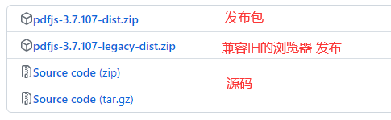

PDF.js 是一个使用 HTML5 构建的可移植文档格式（PDF）查看器。


## 源码使用方式

pdf.js 的源码下载链接：https://github.com/mozilla/pdf.js

### 目录结构

```tex
├── docs/                                  - 网站源代码
├── examples/                              - 简单用法示例
├── extensions/                            - 浏览器扩展源代码
├── external/                              - 第三方代码
├── l10n/                                  - 翻译文件
├── src/
│   ├── core/                              - 核心层
│   ├── display/                           - 显示层
│   ├── shared/                            - 核心层和显示层之间的共享/共享代码
│   ├── interfaces.js                      - 核心/显示层的接口定义
│   └── pdf.*.js                           - 用于捆绑的包装文件
├── test/                                  - 单元、字体、引用和集成测试
├── web/                                   - 查看器层
├── LICENSE
├── README.md
├── gulpfile.js                            - 构建脚本/逻辑
├── package-lock.json                      - 固定依赖版本
└── package.json                           - 包定义和依赖项
```


### 使用方式

下载好源码包，解压缩得到如上 目录结构 的文件；

需要提前安装 **node.js** 工具，下载链接：https://nodejs.org/en

在源码目录中执行命令：

```shell
# 安装 gulp 命令工具
npm install -g gulp-cli

# 按照 package.json 文件的内容, 在安装依赖包, 会在生成 node_modules 目录 
npm install

# 启动 gulp 服务
gulp server
```


服务启动成功后，可通过 **`http://localhost:8888/` + 文件路径** 访问本地的 pdf 文件。如：

* http://localhost:8888/web/viewer.html
* http://localhost:8888/test/pdfs/?frame


### 编译源码包

执行命令：

```shell
gulp generic

# 如果兼容老的浏览器, 执行命令
gulp generic-legacy
```

会生成 `build/` 目录。


构建包的内容在 `build/generic/` 目录下；


## 构建包使用方式

### 目录结构

```tex
├── build/
│   ├── pdf.js                             - 显示层
│   ├── pdf.js.map                         - 显示层的源映射
│   ├── pdf.worker.js                      - 核心层
│   └── pdf.worker.js.map                  - 核心层的源映射
├── web/
│   ├── cmaps/                             - 字符映射（核心需要）
│   ├── compressed.tracemonkey-pldi-09.pdf - 用于测试目的的pdf文件
│   ├── debugger.js                        - 有用的调试功能
│   ├── images/                            - 查看器和注释图标的图像
│   ├── locale/                            - 翻译文件
│   ├── viewer.css                         - 查看器样式表
│   ├── viewer.html                        - 查看器布局
│   ├── viewer.js                          - 查看器层
│   └── viewer.js.map                      - 查看器层的源映射
└── LICENSE
```


### 使用方式

pdf.js 的构建包下载链接：https://github.com/mozilla/pdf.js/releases



下载好发布包，解压缩得到如上 目录结构 的文件，将该目录的文件上传到自己的 服务器上（如：github 托管的服务器）；

上传方式参考 [github_page](../git/github_page.md) 文档；

按照文档上传成功后，可通过如下链接：`https://username.github.io/pdf.js/web/viewer.html?file=./compressed.tracemonkey-pldi-09.pdf` 访问仓库下的 pdf 文件（**file=** 后面的文件路径是相对于 `web/viewer.html` 文件的路径）；


